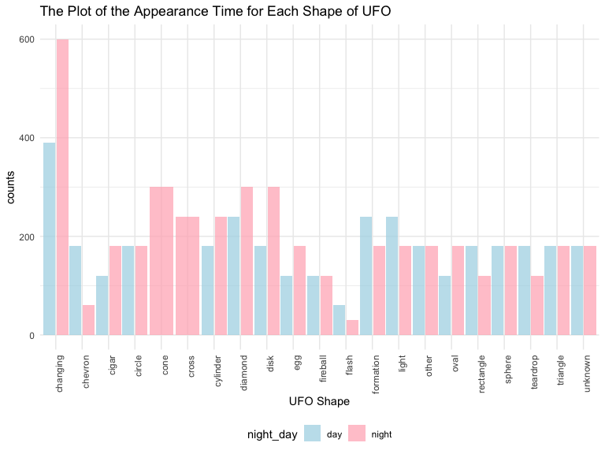
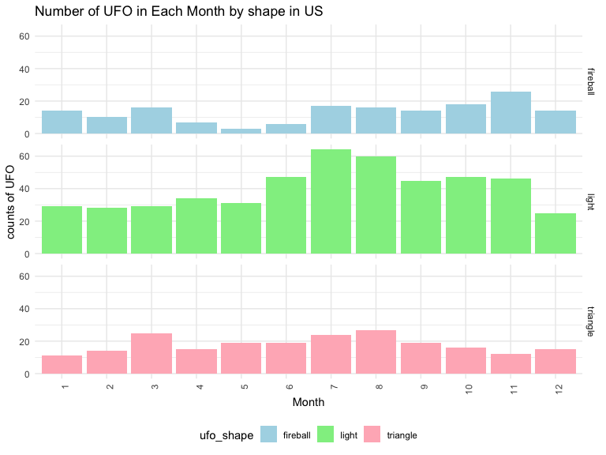

Chi-square
================
Ran Wang
11/8/2019

## reading data

``` r
ufo_data = readr::read_csv("./data/tidied_data_final.csv")
```

    ## Parsed with column specification:
    ## cols(
    ##   latitude = col_double(),
    ##   longitude = col_double(),
    ##   date_time = col_character(),
    ##   city_description = col_character(),
    ##   ufo_shape = col_character(),
    ##   encounter_length = col_double(),
    ##   described_encounter_length = col_character(),
    ##   description = col_character(),
    ##   date_documented = col_character(),
    ##   country = col_character(),
    ##   state = col_character(),
    ##   city = col_character()
    ## )

``` r
ufo_day_night_shape =
ufo_data %>%  
separate(date_time, into = c( "date","time"), sep = " " ) %>%
separate(date, into = c("month","day","year"), sep = "/") %>%
separate(time, into = c("hour","minute"), sep = ":") %>% 
mutate(hour=recode(hour, "00"="24")) %>% 
filter(country == "USA") %>% 
mutate(year_1 = case_when(year >= 1950 ~ "true",
                          TRUE ~"false")) %>% 
filter(year_1 == "true") %>% 
select(-year_1) %>% 
mutate(hour = as.numeric(hour)) %>% 
mutate(night_day = case_when(18 <= hour & hour <= 24~ "night",
                             1 <= hour & hour <= 6 ~ "night",
                             TRUE ~ "day")) %>% 
group_by(ufo_shape, night_day) %>% 
summarize(count_shape = n()) %>% 
  ggplot(aes(x = ufo_shape, y = count_shape, group = night_day)) +
  geom_col(aes(fill = night_day), alpha = .75, position = position_dodge(1)) +
  scale_fill_manual(
    values = c("lightblue","lightpink"), 
    labels = c("day","night")
    ) +
  theme(axis.text.x = element_text(angle = 90, hjust = 1)) +
  labs(title = "The Plot of the Appearance Time for Each Shape of UFO", 
       y = "counts",
       x = "UFO Shape")
  
  ufo_day_night_shape
```


``` r
ufo_day_night_length =
ufo_data %>%  
separate(date_time, into = c( "date","time"), sep = " " ) %>%
separate(date, into = c("month","day","year"), sep = "/") %>%
separate(time, into = c("hour","minute"), sep = ":") %>% 
mutate(hour=recode(hour, "00"="24")) %>% 
filter(country == "USA") %>% 
mutate(year_1 = case_when(year >= 1950 ~ "true",
                          TRUE ~"false")) %>% 
filter(year_1 == "true") %>% 
select(-year_1) %>% 
mutate(hour = as.numeric(hour)) %>% 
mutate(night_day = case_when(18 <= hour & hour <= 24~ "night",
                             1 <= hour & hour <= 6 ~ "night",
                             TRUE ~ "day")) %>% 
  group_by(ufo_shape, night_day) %>% 
           summarize(median_length = median(encounter_length),
count = n()) %>% 
  filter(count > 100)%>% 
  ggplot(aes(x = ufo_shape, y = median_length, group = night_day)) +
  geom_col(aes(fill = night_day), alpha = .75, position = position_dodge(1)) +
  scale_fill_manual(
    values = c("lightblue","lightpink"), 
    labels = c("day","night")
    ) +
  theme(axis.text.x = element_text(angle = 90, hjust = 1)) +
  labs(title = "The Plot of the Appearance Time for Each Shape of UFO", 
       y = "counts",
       x = "UFO Shape")
  
  ufo_day_night_length
```



``` r
#data_summary <- function(x) {
   #m <- mean(x)
  # ymin <- m-sd(x)
   #ymax <- m+sd(x)
   #return(c(y=m,ymin=ymin,ymax=ymax))
#}

ufo_day_night_length =
ufo_data %>%  
na.omit(ufo_data) %>% 
separate(date_time, into = c( "date","time"), sep = " " ) %>%
separate(date, into = c("month","day","year"), sep = "/") %>%
separate(time, into = c("hour","minute"), sep = ":") %>% 
mutate(hour=recode(hour, "00"="24")) %>% 
filter(country == "USA") %>% 
mutate(year_1 = case_when(year >= 1950 ~ "true",
                          TRUE ~"false")) %>% 
filter(year_1 == "true") %>% 
select(-year_1) %>% 
mutate(hour = as.numeric(hour)) %>% 
mutate(night_day = case_when(19 <= hour & hour <= 24~ "night",
                             1 <= hour & hour <= 6 ~ "night",
                             TRUE ~ "day")) %>%
group_by(night_day) %>% 
summarize(mean_length_time = mean(encounter_length)) %>% 
knitr::kable(digits = 1)


#ggplot(aes(x = night_day, y = encounter_length)) + 
#geom_violin(aes(fill = night_day, color = night_day),trim = TRUE, color = "lightblue", alpha = .5, position = position_dodge(1))  + 
  #show the mean and sd
  #stat_summary(mapping = aes(group = night_day),fun.y = mean, position = position_dodge(1), geom = "point", color = "black", size = 4) +
  #stat_summary (mapping = aes(group = night_day),fun.data=data_summary,position = position_dodge(1),geom="crossbar", width=0.2,color = "black") +
   #scale_y_continuous(breaks = c(0, 1, 2, 3, 4, 5, 25, 55, 85, 5000000)
  #) 

ufo_day_night_length
```

| night\_day | mean\_length\_time |
| :--------- | -----------------: |
| day        |             7185.6 |
| night      |             5686.9 |

``` r
ufo_month_shape =
ufo_data %>%  
na.omit(ufo_data) %>% 
separate(date_time, into = c( "date","time"), sep = " " ) %>%
separate(date, into = c("month","day","year"), sep = "/") %>%
separate(time, into = c("hour","minute"), sep = ":") %>% 
mutate(hour=recode(hour, "00"="24")) %>% 
filter(country == "USA") %>% 
mutate(year_1 = case_when(year >= 1950 ~ "true",
                          TRUE ~"false")) %>% 
mutate(month = forcats::fct_relevel(month, c("0","1","2","3","4","5","6","7","8","9","10","11","12"))) %>% 
filter(year_1 == "true") %>% 
select(-year_1) %>%
filter(ufo_shape == "light" |ufo_shape == "triangle"|ufo_shape == "fireball") %>% 
group_by(ufo_shape, month) %>% 
summarize(count_shape = n()) %>% 
  ggplot(aes(x = month, y = count_shape, fill = ufo_shape)) +
  geom_col() +
  facet_grid(ufo_shape~.) +
  theme(axis.text.x = element_text(angle = 90, hjust = 1)) +
  labs(
    title = "Number of UFO in Each Month by shape in US",
    x = "Month",
    y = "counts of UFO"
  ) +
  scale_fill_manual(values = c("lightblue","lightgreen","lightpink"), labels = c("fireball","light","triangle")
    ) 
  
  
 ufo_month_shape
```



``` r
ufo_month_counts_plot =
ufo_data %>%  
separate(date_time, into = c( "date","time"), sep = " " ) %>%
separate(date, into = c("month","day","year"), sep = "/") %>%
filter(country == "USA") %>% 
mutate(year_1 = case_when(year >= 1950 ~ "true",
                          TRUE ~"false")) %>% 
mutate(month = forcats::fct_relevel(month, c("0","1","2","3","4","5","6","7","8","9","10","11","12"))) %>% 
filter(year_1 == "true") %>% 
select(-year_1) %>% 
group_by(month) %>% 
summarize(count_month = n()) %>% 
  ggplot(aes(x = month, y = count_month)) +
  geom_col(aes(fill = month), alpha = .75, position = position_dodge(1)) +
  #scale_fill_manual(
    #values = c("lightblue","lightpink"), 
    #labels = c("day","night")
    #) +
  theme(axis.text.x = element_text(angle = 90, hjust = 1)) +
  labs(title = "The Plot of the Appearance UFO for Each Month", 
       y = "counts",
       x = "Month")
  
ufo_month_counts_plot
```


``` r
ufo_month_counts_table = 
ufo_data %>%  
separate(date_time, into = c( "date","time"), sep = " " ) %>%
separate(date, into = c("month","day","year"), sep = "/") %>%
filter(country == "USA") %>% 
mutate(year_1 = case_when(year >= 1950 ~ "true",
                          TRUE ~"false")) %>% 
mutate(month = forcats::fct_relevel(month, c("0","1","2","3","4","5","6","7","8","9","10","11","12"))) %>% 
filter(year_1 == "true") %>% 
select(-year_1) %>% 
group_by(month) %>% 
summarize(count_month = n()) %>% 
  pivot_wider(id_cols = month,
            names_from = month, 
            values_from = count_month)

ufo_month_counts_table
```

    ## # A tibble: 1 x 12
    ##     `1`   `2`   `3`   `4`   `5`   `6`   `7`   `8`   `9`  `10`  `11`  `12`
    ##   <int> <int> <int> <int> <int> <int> <int> <int> <int> <int> <int> <int>
    ## 1  4595  3841  4501  4466  4268  6440  7642  6844  6224  6258  5699  4660

``` r
ufo_month_counts_table %>% 
chisq.test( correct = TRUE)
```

    ## 
    ##  Chi-squared test for given probabilities
    ## 
    ## data:  .
    ## X-squared = 2980.3, df = 11, p-value < 2.2e-16

``` r
ufo_2000 =
ufo_data %>%  
na.omit(ufo_data) %>% 
separate(date_time, into = c( "date","time"), sep = " " ) %>%
separate(date, into = c("month","day","year"), sep = "/") %>% 
filter(country == "USA") %>% 
mutate(year_1 = case_when(year >= 2000 ~ "true",
                          TRUE ~"false")) %>% 
filter(year_1 == "true") %>% 
group_by(year,state) %>% 
mutate(count = n()) %>% 
ungroup() %>% 
select(year,state,count) %>% 
distinct() %>% 
arrange(year) %>% 
pivot_wider(id_cols = state,
            names_from = year, 
            values_from = count) 

#fill the NA with 0
clean_ufo_2000 <- ufo_2000
clean_ufo_2000[is.na(clean <-  clean_ufo_2000)] <- 0  
clean_ufo_2000
```

    ## # A tibble: 49 x 16
    ##    state `2000` `2001` `2002` `2003` `2004` `2005` `2006` `2007` `2008` `2009`
    ##    <chr>  <dbl>  <dbl>  <dbl>  <dbl>  <dbl>  <dbl>  <dbl>  <dbl>  <dbl>  <dbl>
    ##  1 NY        12     28     21     41     32     27     30     41     19     31
    ##  2 TX         6      7      2      4      2      4      4      3      4      5
    ##  3 WA        13      8      3     10      8      8      6      5      3      2
    ##  4 OR         5      5      2      2      1      2      1      0      0      1
    ##  5 CT         1      0      1      0      0      1      0      0      1      1
    ##  6 PA         4      3      0      2      2      1      3      1      4      1
    ##  7 OK         1      3      0      1      0      2      0      0      1      2
    ##  8 CA        18      8     14     13     11      9     13     10     16      9
    ##  9 FL         7      5      2      3      5      7      3      3      2      1
    ## 10 OH         6      0      4      1      3      2      3      1      0      1
    ## # … with 39 more rows, and 5 more variables: `2010` <dbl>, `2011` <dbl>,
    ## #   `2012` <dbl>, `2013` <dbl>, `2014` <dbl>

``` r
clean_ufo_2000
```

    ## # A tibble: 49 x 16
    ##    state `2000` `2001` `2002` `2003` `2004` `2005` `2006` `2007` `2008` `2009`
    ##    <chr>  <dbl>  <dbl>  <dbl>  <dbl>  <dbl>  <dbl>  <dbl>  <dbl>  <dbl>  <dbl>
    ##  1 NY        12     28     21     41     32     27     30     41     19     31
    ##  2 TX         6      7      2      4      2      4      4      3      4      5
    ##  3 WA        13      8      3     10      8      8      6      5      3      2
    ##  4 OR         5      5      2      2      1      2      1      0      0      1
    ##  5 CT         1      0      1      0      0      1      0      0      1      1
    ##  6 PA         4      3      0      2      2      1      3      1      4      1
    ##  7 OK         1      3      0      1      0      2      0      0      1      2
    ##  8 CA        18      8     14     13     11      9     13     10     16      9
    ##  9 FL         7      5      2      3      5      7      3      3      2      1
    ## 10 OH         6      0      4      1      3      2      3      1      0      1
    ## # … with 39 more rows, and 5 more variables: `2010` <dbl>, `2011` <dbl>,
    ## #   `2012` <dbl>, `2013` <dbl>, `2014` <dbl>

``` r
clean_ufo_2000 %>% 
  select(-state) %>% 
chisq.test(correct = TRUE)
```

    ## 
    ##  Pearson's Chi-squared test
    ## 
    ## data:  .
    ## X-squared = 717.27, df = 672, p-value = 0.11

ufo\_shape = ufo\_data %\>% na.omit(ufo\_data) %\>% separate(date\_time,
into = c( “date”,“time”), sep = " " ) %\>% separate(date, into =
c(“month”,“day”,“year”), sep = “/”) %\>% filter(country == “us”) %\>%
filter(ufo\_shape == “circle”|ufo\_shape == “triangle”|ufo\_shape ==
“light”) %\>% group\_by(state) %\>% count(ufo\_shape) %\>% ungroup()
%\>% group\_by(state) %\>% mutate(total=sum(n)) %\>% mutate( ufo\_shape
= factor(ufo\_shape), ufo\_shape = forcats::fct\_reorder(ufo\_shape, n))

time\_month = ufo\_data %\>% na.omit(ufo\_data) %\>%
separate(date\_time, into = c( “date”,“time”), sep = " " ) %\>%
separate( date, into = c(“month”,“day”,“year”), sep = “/”) %\>%
filter(country == “us”) %\>% separate(time, into = c(“hour”, “minute”),
sep = “:”) %\>% mutate(hour = recode(hour, “24” = “00”)) %\>%
filter(hour == 18| hour == 19 | hour == 20| hour == 21| hour == 22| hour
== 23| hour == 00) %\>% mutate(hour = paste0(hour, “:00-”, hour, “:59”))
%\>% select(-minute) %\>% mutate(month =
month.name\[as.numeric(month)\]) %\>% group\_by(hour, month) %\>%
summarize(n = n()) %\>% pivot\_wider(id\_cols = month, names\_from =
hour, values\_from = n)

time\_month time\_month %\>% select(-month) %\>% chisq.test( correct =
TRUE)

group\_by(night\_day) %\>% mutate(count = n()) %\>% ungroup() %\>%

select(year,state,count) %\>% distinct() %\>% arrange(year) %\>%
pivot\_wider(id\_cols = state, names\_from = year, values\_from = count)

\#fill the NA with 0 clean\_ufo \<- ufo clean\_ufo\[is.na(clean \<-
clean\_ufo)\] \<- 0

clean\_ufo clean\_ufo %\>% select(-state) %\>% chisq.test( correct =
TRUE)
