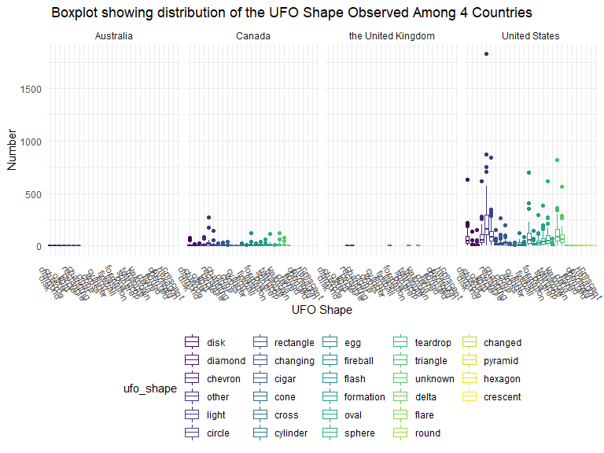
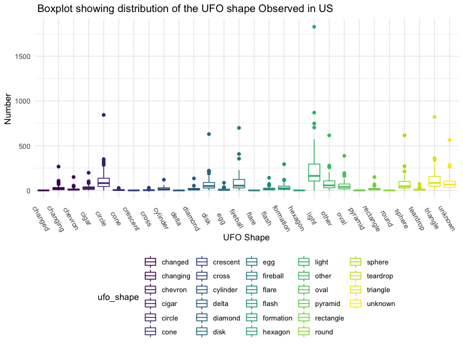

visualization
================
Keyi Wang, Jingyi Tang
11/8/2019

## reading data

``` r
ufo_data = readr::read_csv("https://raw.githubusercontent.com/rfordatascience/tidytuesday/master/data/2019/2019-06-25/ufo_sightings.csv")
```

    ## Parsed with column specification:
    ## cols(
    ##   date_time = col_character(),
    ##   city_area = col_character(),
    ##   state = col_character(),
    ##   country = col_character(),
    ##   ufo_shape = col_character(),
    ##   encounter_length = col_double(),
    ##   described_encounter_length = col_character(),
    ##   description = col_character(),
    ##   date_documented = col_character(),
    ##   latitude = col_double(),
    ##   longitude = col_double()
    ## )

``` r
ufo =
ufo_data %>%  
na.omit(ufo_data) %>% 
separate(date_time, into = c( "date","time"), sep = " " ) %>%
separate( date, into = c("month","day","year"), sep = "/") 
```

## Number of UFO observed across time among 4 countries –Line Plot

``` r
  ## 4 countries plots
  ufo %>% 
  group_by(country,state)%>%
  count(ufo_shape) %>%
  ungroup()%>%
  mutate(
  ufo_shape = factor(ufo_shape),
  ufo_shape = forcats::fct_inorder(ufo_shape, n ),
  country = recode(country , "us" = "United States", 
                             "au" = "Australia",
                             "gb" = "the United Kingdom",
                             "ca" = "Canada")) %>%
  ggplot(aes(x = ufo_shape, y = n )) + geom_boxplot(aes(color = ufo_shape)) +
  theme(axis.text.x = element_text(angle = 300)) +
  facet_grid(. ~ country) +
  labs(
    title = " Boxplot showing distribution of the UFO Shape Observed Among 4 Countries ",
    x = "UFO Shape",
    y = "Number"
  )
```



``` r
### US plot 
  ufo %>%
  filter(country == "us")%>%
  group_by(state) %>%
  count(ufo_shape) %>%
  mutate(
  ufo_shape = factor(ufo_shape),
  ufo_shape = forcats::fct_inorder(ufo_shape, n )) %>%
  ggplot(aes(x = ufo_shape, y = n, group = ufo_shape)) + geom_boxplot(aes(color = ufo_shape)) +
  theme(axis.text.x = element_text(angle = 300)) +
   labs(
    title = " Boxplot showing distribution of the UFO shape Observed in US ",
    x = "UFO Shape",
    y = "Number"
  )
```


