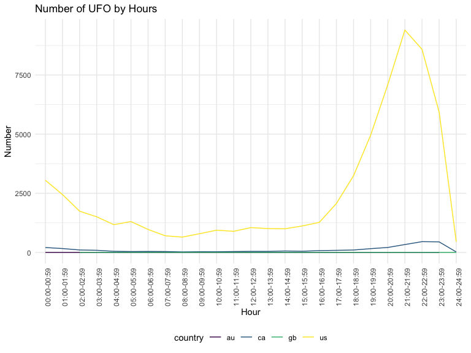
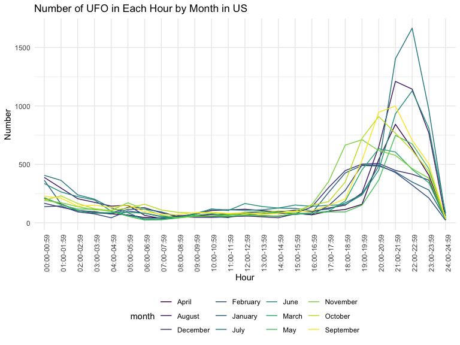

visualisation\_jl
================
J L
November 9, 2019

reading data
------------

``` r
ufo_data = readr::read_csv("https://raw.githubusercontent.com/rfordatascience/tidytuesday/master/data/2019/2019-06-25/ufo_sightings.csv")
```

    ## Parsed with column specification:
    ## cols(
    ##   date_time = col_character(),
    ##   city_area = col_character(),
    ##   state = col_character(),
    ##   country = col_character(),
    ##   ufo_shape = col_character(),
    ##   encounter_length = col_integer(),
    ##   described_encounter_length = col_character(),
    ##   description = col_character(),
    ##   date_documented = col_character(),
    ##   latitude = col_double(),
    ##   longitude = col_double()
    ## )

``` r
ufo =
ufo_data %>%  
na.omit(ufo_data) %>% 
separate(date_time, into = c( "date","time"), sep = " " ) %>%
separate( date, into = c("month","day","year"), sep = "/") 
```

line plot: UFO by time
----------------------

``` r
plot_time = ufo %>% 
  separate(time, into = c("hour", "minute"), sep = ":") %>% 
  mutate(hour = paste0(hour, ":00-", hour, ":59")) %>% 
  mutate(hour = recode(hour, "24" = "00")) %>%
  select(-minute) %>% 
  group_by(hour, country) %>% 
  summarize(n = n()) %>% 
  ggplot(aes(x = hour, y = n, color = country)) +
  geom_line(aes(group = country)) +
  theme(axis.text.x = element_text(angle = 90, hjust = 1)) +
  labs(
    title = "Number of UFO by Hours", 
    x = "Hour",
    y = "Number"
  )

# display the plot
plot_time
```



spaghetti plot: UFO in US by year (x=hour, y=year/month, group = us)
--------------------------------------------------------------------

``` r
plot_us_month = ufo %>% 
  filter(country == "us") %>% 
  separate(time, into = c("hour", "minute"), sep = ":") %>% 
  mutate(hour = paste0(hour, ":00-", hour, ":59")) %>% 
  select(-minute) %>% 
  mutate(month = month.name[as.numeric(month)]) %>% 
  group_by(hour, month) %>% 
  summarize(n = n()) %>% 
  ggplot(aes(x = hour, y = n, color = month)) +
  geom_line(aes(group = month)) +
  theme(axis.text.x = element_text(angle = 90, hjust = 1)) +
  labs(
    title = "Number of UFO in Each Hour by Month in US",
    x = "Hour",
    y = "Number"
  )

# display the plot
plot_us_month
```


