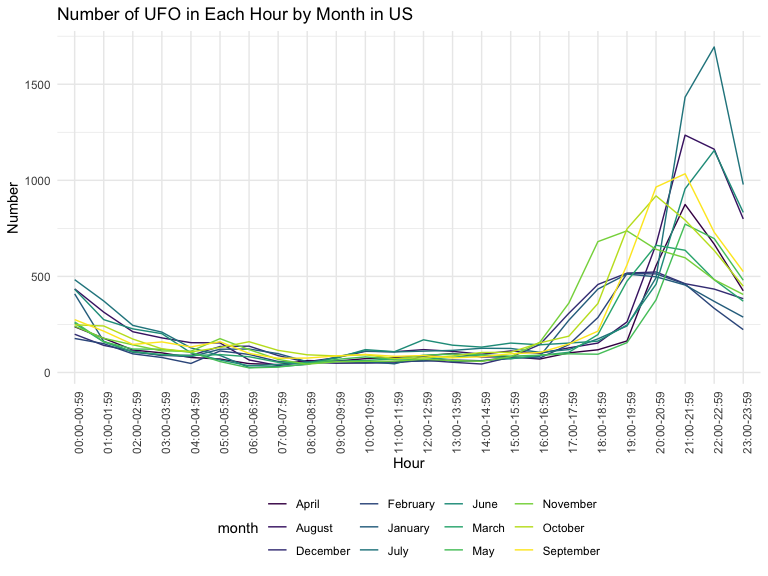
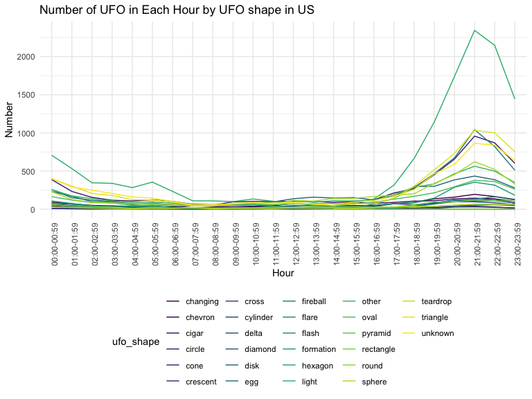

visualisation\_jl
================
J L
November 9, 2019

reading data
------------

``` r
ufo_data = read_csv("./data/tidied_data_final.csv")
```

    ## Parsed with column specification:
    ## cols(
    ##   latitude = col_double(),
    ##   longitude = col_double(),
    ##   date_time = col_character(),
    ##   city_description = col_character(),
    ##   ufo_shape = col_character(),
    ##   encounter_length = col_double(),
    ##   described_encounter_length = col_character(),
    ##   description = col_character(),
    ##   date_documented = col_character(),
    ##   country = col_character(),
    ##   state = col_character(),
    ##   city = col_character()
    ## )

``` r
ufo =
ufo_data %>%  
separate(date_time, into = c( "date","time"), sep = " " ) %>%
separate( date, into = c("month","day","year"), sep = "/") 
```

line plot: UFO by time
----------------------

``` r
plot_time = ufo %>% 
  separate(time, into = c("hour", "minute"), sep = ":") %>% 
  mutate(hour = recode(hour, "24" = "00")) %>%
  mutate(hour = paste0(hour, ":00-", hour, ":59")) %>% 
  select(-minute) %>% 
  group_by(hour, country) %>% 
  summarize(n = n()) %>% 
  ggplot(aes(x = hour, y = n, color = country)) +
  geom_line(aes(group = country)) +
  theme(axis.text.x = element_text(angle = 90, hjust = 1)) +
  labs(
    title = "Number of UFO by Hours", 
    x = "Hour",
    y = "Number"
  )

# display the plot
plot_time
```


percentage of UFO number (x = hour, y = percentage = number of UFO in the hour in given country / total number of UFO in given country)
---------------------------------------------------------------------------------------------------------------------------------------

``` r
num_country = ufo %>% 
  group_by(country) %>% 
  summarize(num_country = n())
hour_country = ufo %>% 
  separate(time, into = c("hour", "minute"), sep = ":") %>% 
  mutate(hour = recode(hour, "24" = "00")) %>%
  mutate(hour = paste0(hour, ":00-", hour, ":59")) %>% 
  select(-minute) %>% 
  group_by(hour, country) %>% 
  summarize(
    n = n()
  ) 
plot_percentage = left_join(hour_country, num_country, by = "country") %>% 
  mutate(percentage = n / num_country) %>% 
  ggplot(aes(x = hour, y = percentage, color = country)) +
  geom_point(aes(group = country)) +
  geom_line(aes(group = country)) +
  theme(axis.text.x = element_text(angle = 90, hjust = 1)) +
  ylim(0, 0.5) +
  labs(
    title = "Percentage of UFO by Countries in 24 Hours", 
    x = "Hour",
    y = "Percentage"
  )
```

spaghetti plot: number of UFO in each hour by month (x=hour, y=year/month, group = us)
--------------------------------------------------------------------------------------

``` r
plot_us_month = ufo %>% 
  filter(country == "USA", year >= 1950) %>% 
  separate(time, into = c("hour", "minute"), sep = ":") %>% 
  mutate(hour = recode(hour, "24" = "00")) %>%
  mutate(hour = paste0(hour, ":00-", hour, ":59")) %>% 
  select(-minute) %>% 
  mutate(month = month.name[as.numeric(month)]) %>% 
  group_by(hour, month) %>% 
  summarize(n = n()) %>% 
  ggplot(aes(x = hour, y = n, color = month)) +
  geom_line(aes(group = month)) +
  theme(axis.text.x = element_text(angle = 90, hjust = 1)) +
  labs(
    title = "Number of UFO in Each Hour by Month in US",
    x = "Hour",
    y = "Number"
  )

# display the plot
plot_us_month
```



spaghetti plot: number of UFO in each hour by shape (x=hour, y=shape, group = us)
---------------------------------------------------------------------------------

``` r
plot_us_shape = ufo %>% 
  filter(country == "USA", year >= 1950) %>% 
  separate(time, into = c("hour", "minute"), sep = ":") %>% 
  mutate(hour = recode(hour, "24" = "00")) %>%
  mutate(hour = paste0(hour, ":00-", hour, ":59")) %>% 
  select(-minute) %>% 
  group_by(hour, ufo_shape) %>% 
  summarize(n = n()) %>% 
  ggplot(aes(x = hour, y = n, color = ufo_shape)) +
  geom_line(aes(group = ufo_shape)) +
  theme(axis.text.x = element_text(angle = 90, hjust = 1)) +
  labs(
    title = "Number of UFO in Each Hour by UFO shape in US",
    x = "Hour",
    y = "Number"
  )

# display the plot
plot_us_shape
```


